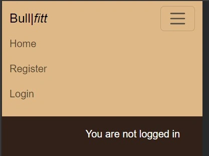
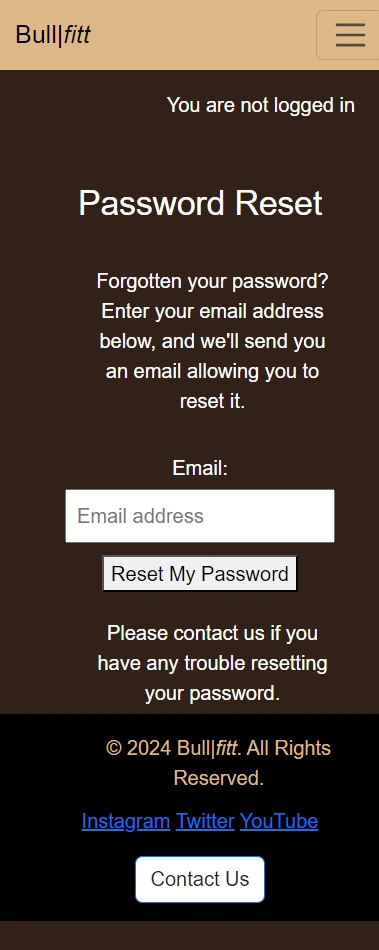
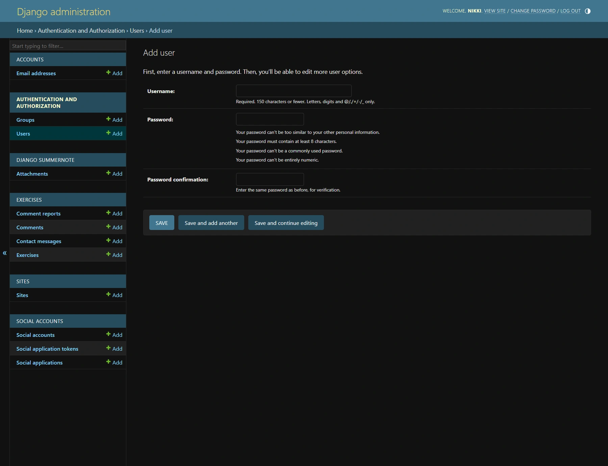

# Welcome to BullFit Blog!

BullFit Blog is your go-to source for fitness knowledge and inspiration. Our blog features a variety of posts about exercises, their benefits, and tips to help you achieve a healthier lifestyle. Whether you’re new to fitness or looking to enhance your routine, we’ve got insights and information to support your journey.

## Table Of Contents:
1. [Design & Planning](#design-&-planning)
    * [Wireframes](#wireframes)
    * [Agile Methodology](#agile-methodology)
    * [User Stories](#user-stories)
    * [Typography](#typography)
    * [Colour Scheme](#colour-scheme)
    * [Database Diagram](#database-diagram)
    
2. [Features](#features)
    * [Navigation](#Navigation)
    * [Footer](#Footer)
    * [Home page](#Home-page)
    * [Sign up page](#Sign-up-page)
    * [Password_reset page](#Password-reset-page)
    * [Password_reset confirmation](#Password-reset-confirmation)
    * [CRUD](#CRUD)
    * [Login page](#Profile-page)
    * [Authentication & Authorisation](#Authentication-Authorisation )

3. [Technologies Used](#technologies-used)
4. [Libraries](#libraries-used)
5. [Testing](#testing)
6. [Bugs](#bugs)
7. [Deployment](#deployment)
8. [Credits](#credits)

## Design & Planning:

### Wireframes
Attach wireframes in this section

## Agile Methodology

### My Approach to Agile Methodology
As I developed this project, I used the Agile methodology because of its flexibility and iterative process. Agile helped me stay organized and adapt as the project evolved. Working in short, manageable cycles (or "sprints") allowed me to make continuous progress and improve each feature step-by-step. This approach gave me the structure I needed to regularly assess my progress and refine the app as I moved forward.

#### Benefits in Testing for Me:

Agile was especially beneficial for testing each function of my app. Since I worked in small increments, I was able to test each feature thoroughly as I completed it. This brought a lot of advantages:

- Quickly Finding Issues: By testing after each sprint, I caught bugs and issues early, avoiding larger problems down the line.
- Better Quality: Testing in each phase ensured that the app’s functionality met my standards before moving on to the next feature.
- Flexibility: As new ideas or changes came up, I was able to easily adjust the plan without losing track of the overall project.
- Continuous Improvement: Each testing cycle helped me fine-tune the app and my own development process, so I could deliver a more polished final product.

### MoSCoW Prioritization
To keep myself focused, I used the MoSCoW method to prioritize the tasks and features I needed to work on. I broke everything down into:

Must Have: Features that were critical to the app’s core functionality.
- Should Have: Important features that weren’t essential, but added significant value.
- Could Have: Features that would be nice to include if time allowed.
- Won’t Have: Features that I decided not to include in the current version.
This prioritization method helped me stay on track, ensuring that I worked on the most important features first and kept the project manageable.

### Managing with GitHub Projects
I used GitHub Projects to organize my tasks and track my progress. Each project board represented an EPIC (a major part of the app), and I created columns like "To Do," "In Progress," "On Hold," "Done," and "Bugs" to visualize where each task stood. I also used labels to categorize tasks based on their priority and organized them into sprints to stay on track.

### Visualizing Progress with the Kanban Board
I relied on a Kanban board to manage my progress. Seeing my tasks move through different stages—from "To Do" to "Done"—gave me a clear sense of accomplishment and kept me motivated throughout the project. It also helped me ensure that no task was overlooked or forgotten.

## Breaking Down the EPICS
Each Epic in my project represented a major feature or functionality of the platform. By breaking these large tasks into smaller, manageable parts, I was able to tackle each piece step-by-step. This ensured that nothing was left incomplete, and every aspect of the app was thoroughly developed.

- [EPIC 1: Add/Edit or Delete Comments](https://github.com/Nikkig087/bullFit/issues/1#issue-2516139676)
- [EPIC 2: Contact Form Accessible to All Users](https://github.com/Nikkig087/bullFit/issues/2#issue-2516143286)
- [EPIC 3: Admin Can View Reported Comments in Read-Only Mode](https://github.com/Nikkig087/bullFit/issues/3#issue-2516144514)
- [EPIC 4: Registered User Can Report a Comment](https://github.com/Nikkig087/bullFit/issues/4#issue-2516145370)
- [EPIC 5: Create new exercise posts](https://github.com/Nikkig087/bullFit/issues/5#issue-2516146316)
- [EPIC 6: Give my thoughts on a specific exercise](https://github.com/Nikkig087/bullFit/issues/6#issue-2516148571)
- [EPIC 7: View a list of different exercises](https://github.com/Nikkig087/bullFit/issues/7#issue-2516154137)
- [EPIC 8: View specific exercise details](https://github.com/Nikkig087/bullFit/issues/8#issue-2516155408)
- [EPIC 9: Enhanced Contact Form Features](https://github.com/Nikkig087/bullFit/issues/9#issue-2516943963)
- [EPIC 10: File Attachments in Contact Form](https://github.com/Nikkig087/bullFit/issues/10#issue-2516953268)

## User Stories

With an emphasis on delivering a seamless user experience, the goal of this project is to provide a comprehensive platform that serves both visitors and registered users. The platform will allow for the development and maintenance of content, present developer profiles, and provide opportunities for interaction.  The following user stories outline the essential functionalities and the rationale behind them.

*************************************
### Developer Stories

- As a **developer**, I want to **create wireframes** so that I can **visually represent the layout and structure of the application.**

- As a **developer**, I want to **create visually engaging and responsive designs** so that **users can easily navigate the website and access relevant information**.

- As a **developer**, I want to **adopt Agile methodology** so that **I can deliver high quality product that meets the needs of the user.**

- As a **developer**, I want to **install and add basic configurations to Django** so that **I can create a working app**.

- As a **developer**, I want to **the platform to load quickly and respond swiftly to user interactions** so that **users can have a seamless experience**.

- As a **developer**, I want to **ensure that all syntax errors are identified and resolved during the code validation process** so that **the code is free from syntax-related issues**.

- As a **developer**, I want to **maintain thorough documentation** so that **code is maintained seamlessly in future**.

- As a **developer**, I want to **ensure that user stories are thoroughly tested** so that **they meet acceptance criteria and deliver the expected functionality**.

- As a **developer**, I want to **deploy the application to Heroku** so that **it is accessible to users online**.

- As a **developer**, I want to **ensure that application meets performance and accessibility standards** so that **provides a seamless experience for all users and performs optimally**.

*************************************************************
### Visitor Stories

- As a **visitor**, I want to **navigate through the platform effortlessly,** so that **I can find relevant sections and features intuitively.**

- As a **visitor**, I want to **able to register an account** so **I can create an account**.

- As a **visitor**, I want to **provide feedback, report issues, and suggest improvements through a contact form,** so that I can **actively participate in improving the platform and receive support when needed**.

****************************************************

### Registered User Stories

- As a **registered user**, I want to **be able to log in and out of my account** so that **I can use the platform**.

- As a **registered user**, I want to **to be able to reset my password** so that **I do not loose access to my account**.
.

- As a **registered user**, I want to **to be able to comment on posts** so that **provide feedback to authors**.

- As a **registered user**, I want to **to be able to delete and edit comments** so that I can **control my engagement on the platform**.

### Admin User Stories

- As an **admin user**, I want **the ability to perform all CRUD (Create, Read, Update, Delete) operations** so that **manually manage, control and edit content**.

- As an **admin user**, I want to **approve comments and posts** so that **I can ensure content quality and appropriateness before it is published**.

## Website Goals and Objectives

* Enhance User Experience:
   - Build a powerful yet user-friendly interface that reflects the strength and energy of the BullFit brand.
   - Ensure seamless performance across all devices, making the platform fully responsive and accessible.
   - Empower users to engage with content by creating, editing, deleting, and reporting comments.
   - Incorporate features like content liking and favoriting to boost user interaction and community engagement.

* Optimize Performance and Accessibility:
   - Fine-tune the platform for lightning-fast load times and smooth user interactions.
   - Meet and exceed accessibility standards, ensuring BullFit is inclusive for all users.

* Support Continuous Improvement and Scalability:
  - Adopt Agile development practices to continuously deliver high-quality features.
  - Design the database and infrastructure to handle growth and increased user activity.

* Enable Growth and Continuous Innovation:
   - Adopt Agile development techniques to continuously roll out high-impact features.

* Encourage Community and Feedback:
  - Provide mechanisms for users to give feedback, report issues, and suggest improvements.
  - Actively engage with user feedback to improve the platform continuously.

* Strengthen Security and Reliability
   - Implement rock-solid authentication and authorization to protect users.
   - Regularly test and refine the platform to ensure BullFit stays stable, secure, and reliable.

## Target Audience

- Developers
- Health and Fitness Coaches
- General Visitors
- Families and Educators
- Sports Enthusiasts

[Back to top](#contents)

### Typography
Explain font you've used for your project
### Colour Scheme
Screenshoot of the colour scheme for your project
### DataBase Diagram

The project's data model is based on an Entity-Relationship Diagram (ERD) that maps out the relationships between the different Django models. At the core is the User model, which extends Django's default User class with fields like id, username, password, and email. Each user can create Exercises that include attributes such as title, description, two levels of detailed descriptions, and images (handled by Cloudinary fields). Exercises are tied to the user who created them through a Foreign Key.

Users can also leave Comments on exercises, with fields for the content of the comment, when it was created, and whether it’s been approved. Additionally, users can report comments by filing CommentReports, which link both the user and the specific comment in question. There’s also a ContactMessage model, which allows visitors to send messages to the site admins.

In terms of relationships, a User can have multiple Exercises, Comments, and CommentReports (one-to-many relationships). Similarly, an Exercise can have many Comments, and a Comment can have multiple CommentReports. The ERD lays this out clearly, showing how the different models connect and interact.

 

## Features:
Explain your features on the website,(navigation, pages, links, forms, input fields, CRUD....)
### Navigation
The Navigation Bar contains the Company Name, links to the Home page, Register Page and Login Page.
#### Navigation Desktop for user not logged in
 
#### Navigation Mobile for user not logged in

#### Navigation Desktop for user logged in
 
#### Navigation Mobile for user logged in

### Footer

### Home-page Desktop

### Home-page Mobile

### Exercise Details Page Desktop

### Exercise Details Page Mobile

### CRUD User
#### Create Comment Desktop Page

#### Create Comment Mobile Page

#### Edit Comment Desktop Page

#### Edit Comment Mobile Page

#### Delete Comment Page

#### Report Comment Page
Note you must be a registered User to log a comment if not then you will be redirected to the login page as per the view snippet below.  Here you can register or sign in, there is also an option to recover your password if you have forgotten it.

### CRUD Admin
#### Create Exercise Post 

#### Edit Exercise Post 

#### Delete Exercise Comment 

#### Approve Comment 

#### Login Page Admin

#### Login Page Desktop

#### Login Page Mobile

### Sign Up Page Desktop

### Sign Up Page Mobile

### Password Reset Page Desktop

### Password Reset Page Mobile

### Password Reset Confirmation Page Desktop

### Password Reset Confirmation Page Mobile

### 404 Page Desktop

### 404 Page Mobile

### User set up page Admin

### Admin Create User

### Admin Create User

### Admin Delete User

### Admin Update User

## Technologies Used
List of technologies used for your project
## Testing
### Lighthouse Homepage Desktop Test

### Lighthouse Homepage Mobile Test

### Lighthouse Exercise Detail Desktop Test

### Lighthouse Exercise Detail Mobile Test

### Browser Compatibility
Check compatability with different browsers
### Responsiveness

### Code Validation
Validate your code HTML, CSS, JS & Python (all pages/files need to be validated!!!), display screenshots

### Manual Testing User Stories

| **User Story** | **Test** | **Pass** |
| --- | --- | :---: |
| As a developer, I want to create wireframes so that I can visually represent the layout and structure of the application. | Verify wireframes match the final structure and design of the platform. | ✓ |
| As a developer, I want to design a database schema so that I can efficiently store and manage platform content, ensuring optimal performance, scalability, and flexibility. | Test if the database schema supports content creation, retrieval, update, and deletion without errors. | ✓ |
| As a developer, I want to create visually engaging and responsive designs so that users can easily navigate the website and access relevant information. | Check if the website layout is responsive on different devices (mobile, tablet, desktop). | ✓ |
| As a developer, I want to adopt Agile methodology so that I can deliver high-quality product that meets the needs of the user. | Confirm that user stories are broken down into manageable tasks, and functionality is delivered incrementally. | ✓ |
| As a developer, I want to install and add basic configurations to Django so that I can create a working app. | Ensure Django is installed correctly and that the app starts without issues. | ✓ |
| As a developer, I want to deploy to Heroku so that I can verify initial setup. | Test if the initial deployment to Heroku is successful, and the app runs as expected online. | ✓ |
| As a developer, I want the platform to load quickly and respond swiftly to user interactions so that users can have a seamless experience. | Measure load times and check responsiveness of user actions across pages. | ✓ |
| As a developer, I want to ensure that all syntax errors are identified and resolved during the code validation process so that the code is free from syntax-related issues. | Run a syntax checker and ensure no syntax errors remain in the codebase. | ✓ |
| As a developer, I want to maintain thorough documentation so that code is maintained seamlessly in the future. | Verify that all major functions and components have corresponding documentation. | ✓ |
| As a developer, I want to ensure that user stories are thoroughly tested so that they meet acceptance criteria and deliver the expected functionality. | Test each user story to confirm they meet acceptance criteria and function as intended. | ✓ |
| As a developer, I want to deploy the application to Heroku so that it is accessible to users online. | Test if the app is accessible through its Heroku URL and functions correctly. | ✓ |
| As a developer, I want to ensure that the application meets performance and accessibility standards so that it provides a seamless experience for all users and performs optimally. | Run performance checks (e.g., Lighthouse), test for accessibility compliance (e.g., WCAG standards). | ✓ |
| As a developer, I want to update my profile information so that I can keep my information current and accurate. | Test the update functionality for developer profiles, ensuring changes reflect immediately. | ✓ |
| As a visitor, I want to navigate through the platform effortlessly, so that I can find relevant sections and features intuitively. | Test navigation across all sections of the platform, ensuring it’s intuitive and easy to use. | ✓ |
| As a visitor, I want to register an account so I can create an account. | Test the registration form and confirm the user can successfully create an account. | ✓ |
| As a visitor, I want to provide feedback, report issues, and suggest improvements through a contact form, so that I can actively participate in improving the platform and receive support when needed. | Submit the contact form and ensure it reaches the intended recipient or displays a confirmation. | ✓ |
| As a registered user, I want to be able to log in and out of my account so that I can use the platform. | Test the login and logout functionality, ensuring it works correctly and updates the session. | ✓ |
| As a registered user, I want to be able to reset my password so that I do not lose access to my account. | Test the password reset functionality by requesting a password reset link and updating the password. | ✓ |
| As a registered user, I want to be able to comment on posts so that I can provide feedback to authors. | Test adding a comment to a post and ensure it is visible after submission. | ✓ |
| As a registered user, I want to be able to delete and edit comments so that I can control my engagement on the platform. | Test the edit and delete functionality for comments, ensuring both actions work as expected. | ✓ |
| As an admin user, I want the ability to perform all CRUD (Create, Read, Update, Delete) operations so that I can manually manage, control, and edit content. | Test CRUD operations across the platform, ensuring the admin user can manage all content as intended. | ✓ |
| As an admin user, I want to approve comments and posts so that I can ensure content quality and appropriateness before it is published. | Test the approval process for both comments and posts, verifying they only go live after approval. | ✓ |

### Manual Testing features

| **Feature** | **Test** | **Pass** |
| --- | --- | :---: |
| User Registration | Test if users can create an account successfully with valid credentials. | ✓ |
| User Login | Test if users can log in with valid credentials and see their profile. | ✓ |
| Password Reset | Test if users can request and reset their password using the password recovery feature. | ✓ |
| Navigation | Test if all navigation links and menus lead to the correct pages without broken links. | ✓ |
| Add/Edit/Delete Post | Test the ability to create, edit, and delete a post. Ensure changes reflect immediately. | ✓ |
| Commenting on Posts | Test if users can add comments to posts. Ensure comments appear immediately. | ✓ |
| Edit/Delete Own Comments | Test if users can edit and delete their own comments, but not comments made by others. | ✓ |
| Search Functionality | Test if the search feature works and returns relevant results. | ✓ |
| Contact Form Submission | Test if the contact form submits correctly and confirmation is received. | ✓ |
| Page Load Time | Measure the page load time to ensure it’s within an acceptable range for user experience. | ✓ |
| Mobile Responsiveness | Test if the platform is fully responsive on different screen sizes (mobile, tablet, desktop). | ✓ |
| Admin CRUD Operations | Test if the admin user can perform Create, Read, Update, and Delete actions on all platform content. | ✓ |
| Content Approval System | Test if the admin user can approve comments/posts before they are publicly visible. | ✓ |
| Admin Search Functionality | Test if the admin can search for exercises, comments, and comment reports efficiently through the admin panel. | ✓ |

attach screenshot

## Bugs
List of bugs and how did you fix them

## Deployment
This website is deployed to Heroku from a GitHub repository, the following steps were taken:

#### Creating Repository on GitHub
- First make sure you are signed into [Github](https://github.com/) and go to the code institutes template, which can be found [here](https://github.com/Code-Institute-Org/gitpod-full-template).
- Then click on **use this template** and select **Create a new repository** from the drop-down. Enter the name for the repository and click **Create repository from template**.
- Once the repository was created, I clicked the green **gitpod** button to create a workspace in gitpod so that I could write the code for the site.

#### Creating an app on Heroku
- After creating the repository on GitHub, head over to [heroku](https://www.heroku.com/) and sign in.
- On the home page, click **New** and **Create new app** from the drop down.
- Give the app a name(this must be unique) and select a **region** I chose **Europe** as I am in Europe, Then click **Create app**.

#### Create a database 
- Log into [CIdatabase maker](https://www.heroku.com/](https://dbs.ci-dbs.net/))
- add your email address in input field and submit the form
- open database link in your email
- paste dabase URL in your DATABASE_URL variable in env.py file and in Heroku config vars

#### Deploying to Heroku.
- Head back over to [heroku](https://www.heroku.com/) and click on your **app** and then go to the **Settings tab**
- On the **settings page** scroll down to the **config vars** section and enter the **DATABASE_URL** which you will set equal to the elephantSQL URL, create **Secret key** this can be anything,
**CLOUDINARY_URL** this will be set to your cloudinary url and finally **Port** which will be set to 8000.
- Then scroll to the top and go to the **deploy tab** and go down to the **Deployment method** section and select **Github** and then sign into your account.
- Below that in the **search for a repository to connect to** search box enter the name of your repository that you created on **GitHub** and click **connect**
- Once it has been connected scroll down to the **Manual Deploy** and click **Deploy branch** when it has deployed you will see a **view app** button below and this will bring you to your newly deployed app.
- Please note that when deploying manually you will have to deploy after each change you make to your repository.
## Credits
List of used resources for your website (text, images, snippets of code, projects....)
